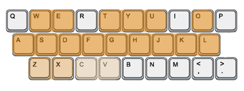

Keyboard Hero
=============
A fun way to play music in your browser, integrating the HTML5 Web Audio API into
a Ruby on Rails/ React.js project. Features four different oscillators and the
ability to record and playback tracks.

Key Mappings
------------
Get playing right away using the keys on this diagram: 

Todos
-----
* Allow users to change octaves
* Add effects
* Drum machine on the number pad
